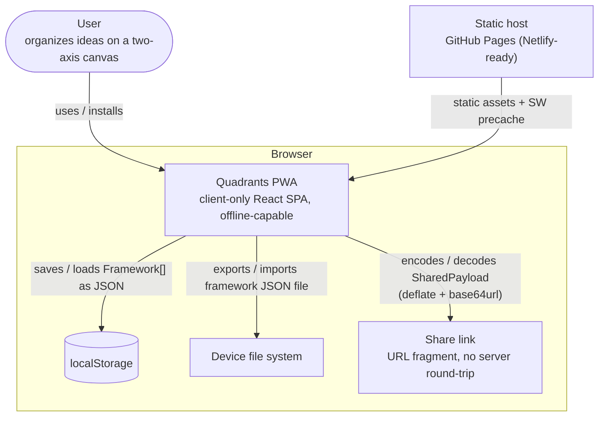
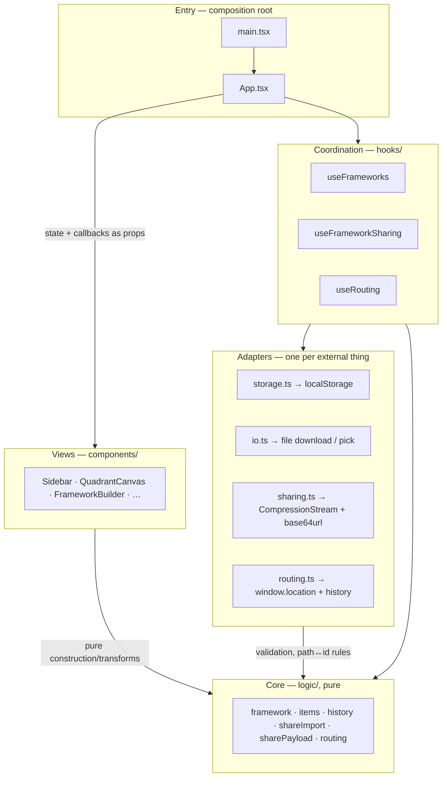
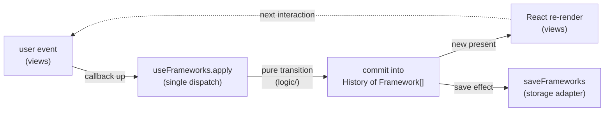

# Architecture

The app is a single deployable — a client-only PWA — organized as a functional
core inside an imperative shell, with one-way data flow. This doc records the
system context, the layer rules, the module relationships, and the accepted
decisions (with the triggers that re-open them). If you are adding code and
wondering where it belongs, the answer is here.

## System context

What is the deployable, and what does it talk to? There is no backend: a static
host serves the built assets once, and from then on everything runs in the
browser. Each external box below is a browser facility wrapped by exactly one
adapter module, and user data leaves the device only through an explicit export
or share link.

The external boxes map one-to-one onto the adapter layer below: `storage.ts`,
`io.ts`, `sharing.ts` + `routing.ts` (a share link is the routing adapter's URL
plus the sharing adapter's payload codec).

## Layers

Four layers, from inside out. Dependencies point inward, only inward: a module
may import from its own layer or any layer further in, never further out.

| Layer            | Where                                                             | May contain                                                                                                                                             | May import from |
| ---------------- | ----------------------------------------------------------------- | ------------------------------------------------------------------------------------------------------------------------------------------------------- | --------------- |
| **Core**         | `src/logic/`                                                      | Pure functions and types only — domain logic, state transitions. No `window`, no DOM, no storage, no network.                                           | core            |
| **Adapters**     | `src/storage.ts`, `src/io.ts`, `src/sharing.ts`, `src/routing.ts` | Side effects, one module per external thing (localStorage, file download/pick, CompressionStream + clipboard payload codec, window.location + history). | core            |
| **Coordination** | `src/hooks/`                                                      | Thin orchestration: wire React state to core transitions and adapter effects. Delegates only — an `if` about the domain belongs in the core.            | adapters, core  |
| **Entry**        | `src/main.tsx`, `src/App.tsx`                                     | The composition root: constructs everything, wires it together.                                                                                         | everything      |

Views (`src/components/`) render from state and raise events through callbacks —
rendering is I/O, so they sit at the shell alongside the adapters. They may
import the pure core (e.g. `createItem` from `logic/items`) but never an adapter
or a hook that owns state; state and effects reach them as props.

`src/types.ts`, `src/colors.ts`, and `src/templates.ts` are pure shared modules;
they sit with the core ring and anything may import them.

### Module relationships

Which layer imports which — every arrow points inward:

A pure rule and its side-effecting counterpart may share a name across rings —
`logic/routing.ts` owns the pathname↔id mapping, `routing.ts` applies it to
`window.location` — the adapter delegates to the core, never the reverse.

### One-way data flow

Every data mutation travels one loop; nothing writes state from the side:

Undo/redo are history navigations (`logic/history.ts`) over the same loop — they
move `present` and re-enter at the render step; the save effect persists
whatever `present` becomes.

## Accepted decisions

| Decision                                                                                                        | Decided    | Re-open when                                                                                                                                                                                                               |
| --------------------------------------------------------------------------------------------------------------- | ---------- | -------------------------------------------------------------------------------------------------------------------------------------------------------------------------------------------------------------------------- |
| **Layer-first folders** (`logic/`, `hooks/`, `components/`, adapters at `src/` root) rather than feature-first. | 2026-07-05 | The app grows a second feature domain, or a feature's files stop changing together — then reorganize by feature first, layer second.                                                                                       |
| **Ambient `Date.now` / `crypto.randomUUID` / `Math.random` in the core** — no injected clock/id (RSRCH-001).    | RSRCH-001  | A real flaky test traced to time/randomness; a need to run the core outside vitest; or sync/CRDT-style features where deterministic replay becomes a product requirement.                                                  |
| **A modal surface's focus is owned by one hook above it**, not split to match the DOM (RFCTR-008).              | RFCTR-008  | A third surface needs to inert something outside itself, or `ConflictDialog` and `EditModal` grow focus restore and all three turn out alike — then extract a shared modal-surface contract instead of repeating this one. |

### Modal surfaces

A modal surface's modality usually spans two DOM regions: the surface itself
(dialog semantics, focus trap, Escape) and the background it covers (`inert`,
and the focus target once the surface closes). Those regions belong to different
components, so splitting ownership to match the DOM leaves no one holding the
whole behavior — and because both halves write `document.activeElement`,
correctness ends up resting on React's effect-commit order rather than on
anything stated.

The rule: **whatever owns the open state owns every focus move that follows from
it.** Closing resolves to exactly one focus target, chosen from why the surface
closed. `useDrawerModality` is the worked example — `Sidebar` renders the drawer
and derives nothing about its own modality.

`useFocusTrap` deliberately stays narrower than this: it is Tab cycling and
Escape for any container, with no opinion about focus-on-open, restore, or the
background. The four surfaces using it (`Sidebar`, `ConflictDialog`,
`EditModal`, `FrameworkBuilder`'s template picker) hand-roll the rest, each
resolving close-focus per the rule above:

- `ConflictDialog` — dismissal focus is owned by `useFrameworkSharing`, which
  owns its open state: every exit navigates and there is no opener control, so
  all three exits resolve to `<main>` (A11Y-021).
- `EditModal` — the parent owning `open` declares the return target via the
  required `openerRef` prop; the modal focuses it on unmount, covering every
  exit through one mechanism. The target must be declared, not captured from
  `document.activeElement`, because the touch path opens the modal without ever
  focusing the trigger (pointerDown + preventDefault, RSRCH-002) (A11Y-022).
