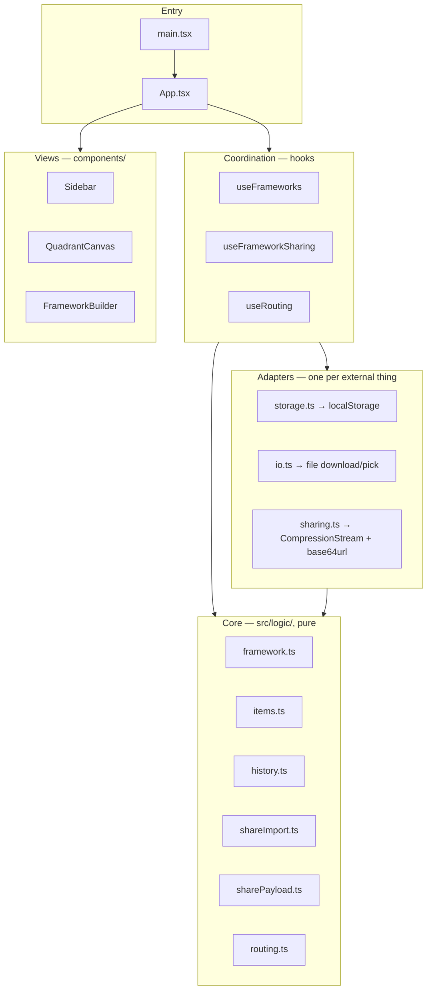

# ARCH-001: write diagrammed architecture doc with layer rules and recorded decisions

## Problem

The codebase follows functional core / imperative shell with one-way data flow,
but no architecture document or diagram exists anywhere in the repo — the layer
rules live implicitly in the code and in a single line of CLAUDE.md. Two
mislayerings crept in unnoticed because the contract is written nowhere:
`src/logic/routing.ts` performing window/history I/O inside the pure-core folder
(RFCTR-004) and domain factories living in the storage adapter (RFCTR-005).

## Outcome

- An architecture document exists in the repo, adjacent to the code it
  describes, containing: the four layers (pure core in `logic/`; adapters
  `storage`/`io`/`sharing`/routing; coordination hooks; entry
  `main.tsx`/`App.tsx`), Mermaid diagrams of the module relationships and the
  one-way data-flow loop (event → pure transition → history commit → render),
  and the dependency rule that imports point only inward.
- The document records accepted decisions with their re-open triggers:
  layer-first folder organization accepted at the current codebase size (decided
  2026-07-05), and ambient time/id generation in the core accepted per
  RSRCH-001.
- CLAUDE.md points to the document, so future feature work and reviews have a
  placement rule to consult.

## Why it matters

Undocumented boundaries erode silently — the two refactor tickets filed from
this audit are the proof. A written, diagrammed contract makes layer violations
visible in review, gives new code an unambiguous home, and keeps recorded
decisions (and the conditions under which to revisit them) from living only in
closed tickets.

## Discovery notes

Advisory. Current-state module relationships observed during the 2026-07-05
audit (post-RFCTR-004/005 the routing adapter box would sit beside the other
adapters):

One-way data flow observed: every mutation funnels through the single `apply`
dispatch in `useFrameworks.ts:32` → `commit` into `History<Framework[]>` → React
re-render → `saveFrameworks` effect persists. Undo/redo are history navigations
over the same loop.

## Related work

- RFCTR-004 (inbox — routing side effects out of the core; the doc should
  describe the post-refactor state)
- RFCTR-005 (inbox — domain factories out of the storage adapter; same)
- RSRCH-001 (done — ambient time/id decision the doc must record)

## Working

- Worked after RFCTR-004 and RFCTR-005 (both resolved earlier this session), so
  the doc describes the post-refactor state as the ticket asked: the routing
  adapter (`src/routing.ts`) sits beside storage/io/sharing, and the factories
  live in the core.
- Wrote `src/architecture.md` (sibling of the code it captures, per the
  diagramming skill): layer table with allowed-import column, module
  relationship flowchart (all arrows inward, edges labeled with what crosses),
  one-way data-flow loop diagram (event → apply → pure transition → history
  commit → render, with the save effect off the commit), and the
  views/shared-pure-modules placement notes.
- Recorded both accepted decisions with re-open triggers: layer-first folders
  (decided 2026-07-05; re-open on a second feature domain) and ambient time/id
  in the core (per RSRCH-001, with its three triggers copied from the decision
  record).
- Added a CLAUDE.md pointer under Details so reviews and feature work consult
  the doc for placement rules.
- Doc-only change (plus CLAUDE.md pointer) — no runtime surface, no new tests;
  full suite still 374/374 via the commit CI hook.
